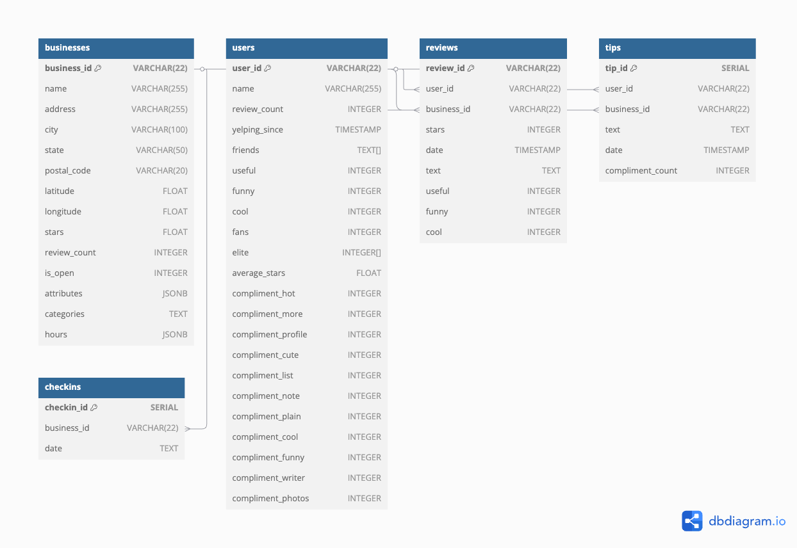

# Project Checkpoint: Yelp Dataset Benchmark

Team members: Arnur Sabet, Diana Chen, Maya Schoucair

## Dataset Selection

We've chosen to work with the Yelp dataset from https://www.yelp.com/dataset, which contains data about businesses, reviews, users, check-ins, and tips. The dataset includes a rich set of relationships that allow us to compare PostgreSQL and MongoDB's performance on various query types.

The full Yelp dataset is quite large (~8.65GB uncompressed) and contains:
- 150,346 businesses
- 6,990,247 reviews

For our benchmark, we're using the complete dataset to get an accurate representation of how each database system handles large-scale data. This approach will provide more meaningful performance benchmarks, especially for complex queries that involve data relationships and aggregations.

## Database Structure

### ER Diagram for PostgreSQL Schema



### PostgreSQL Schema

We've designed the following schema for the Yelp dataset in PostgreSQL:

```sql
CREATE TABLE businesses (
    business_id VARCHAR(22) PRIMARY KEY,
    name VARCHAR(255),
    address VARCHAR(255),
    city VARCHAR(100),
    state VARCHAR(50),
    postal_code VARCHAR(20),
    latitude FLOAT,
    longitude FLOAT,
    stars FLOAT,
    review_count INTEGER,
    is_open INTEGER,
    attributes JSONB,
    categories TEXT,
    hours JSONB
);
```
```sql
CREATE TABLE users (
    user_id VARCHAR(22) PRIMARY KEY,
    name VARCHAR(255),
    review_count INTEGER,
    yelping_since TIMESTAMP,
    friends TEXT[],
    useful INTEGER,
    funny INTEGER,
    cool INTEGER,
    fans INTEGER,
    elite INTEGER[],
    average_stars FLOAT,
    compliment_hot INTEGER,
    compliment_more INTEGER,
    compliment_profile INTEGER,
    compliment_cute INTEGER,
    compliment_list INTEGER,
    compliment_note INTEGER,
    compliment_plain INTEGER,
    compliment_cool INTEGER,
    compliment_funny INTEGER,
    compliment_writer INTEGER,
    compliment_photos INTEGER
);
```
```sql
CREATE TABLE reviews (
    review_id VARCHAR(22) PRIMARY KEY,
    user_id VARCHAR(22) REFERENCES users(user_id),
    business_id VARCHAR(22) REFERENCES businesses(business_id),
    stars INTEGER,
    date TIMESTAMP,
    text TEXT,
    useful INTEGER,
    funny INTEGER,
    cool INTEGER
);
```

```sql
CREATE TABLE tips (
    tip_id SERIAL PRIMARY KEY,
    user_id VARCHAR(22) REFERENCES users(user_id),
    business_id VARCHAR(22) REFERENCES businesses(business_id),
    text TEXT,
    date TIMESTAMP,
    compliment_count INTEGER
);
```
```sql
CREATE TABLE checkins (
    checkin_id SERIAL PRIMARY KEY,
    business_id VARCHAR(22) REFERENCES businesses(business_id),
    date TEXT
);
```

## System and Database Setup

### Computing Resources

We are using our local computers for this project, with Docker to ensure consistent environments. Each team member has the following setup:

- Macbook Air M3, 16GB, 512 SSD
- Docker containers for PostgreSQL 17 and MongoDB
- Python environment for data processing

### Data Loading Process for PostgreSQL

We created Python scripts to load the full Yelp dataset into PostgreSQL. Here's a high-level overview of our approach:

1. Download and extract the Yelp dataset JSON files
2. Create the database and tables using the schema defined above
3. Parse the JSON files and insert data into the appropriate tables using batch processing
4. Create indices to improve query performance

The actual data loading process includes careful handling of date formats and array conversions:

```python
# Define a function to parse dates safely
def safe_parse_date(date_str, default='2010-01-01'):
    if not date_str:
        return datetime.strptime(default, '%Y-%m-%d')
    
    # Try different formats
    formats = ['%Y-%m-%d %H:%M:%S', '%Y-%m-%d']
    for fmt in formats:
        try:
            return datetime.strptime(date_str, fmt)
        except ValueError:
            continue
    
    # If all formats fail, return default
    return datetime.strptime(default, '%Y-%m-%d')

# Parse friends list
friends_list = data.get('friends', '')
if isinstance(friends_list, str) and friends_list:
    friends_list = friends_list.split(', ')
elif not isinstance(friends_list, list):
    friends_list = []
    
# Handle elite years array
elite_years = data.get('elite', '')
if isinstance(elite_years, str) and elite_years:
    elite_years = [int(year) for year in elite_years.split(',') if year.strip()]
elif not isinstance(elite_years, list):
    elite_years = []
```

For efficient batch processing, we implemented a helper function:

```python
def batch_insert(data_list, insert_query, batch_size=5000):
    total_processed = 0
    for i in range(0, len(data_list), batch_size):
        batch = data_list[i:i+batch_size]
        execute_values(cursor, query, batch)
        conn.commit()
        total_processed += len(batch)
        print(f"  Inserted {total_processed} records...")
    return total_processed
```

We created optimized indices for all tables to improve query performance:

```sql
CREATE INDEX idx_businesses_city ON businesses(city);
CREATE INDEX idx_businesses_stars ON businesses(stars);
CREATE INDEX idx_businesses_categories ON businesses USING gin(to_tsvector('english', coalesce(categories, '')));
CREATE INDEX idx_reviews_user_id ON reviews(user_id);
CREATE INDEX idx_reviews_business_id ON reviews(business_id);
CREATE INDEX idx_reviews_stars ON reviews(stars);
CREATE INDEX idx_reviews_date ON reviews(date);
CREATE INDEX idx_tips_user_id ON tips(user_id);
CREATE INDEX idx_tips_business_id ON tips(business_id);
CREATE INDEX idx_checkins_business_id ON checkins(business_id);
```

## PostgreSQL Tasks and Queries

For our checkpoint, we've implemented several test queries that demonstrate the capabilities of PostgreSQL with the Yelp dataset.

### Query 1: Top-rated restaurants with at least 100 reviews

This query finds the highest-rated restaurants that have received at least 100 reviews.

#### Problem Description
Users often want to find the best-rated restaurants in a city based on Yelp reviews. This query helps identify restaurants with consistently high ratings and sufficient review volume to ensure reliability.

#### Query
```sql
SELECT 
    b.business_id,
    b.name,
    b.city,
    b.state,
    b.stars AS average_rating,
    b.review_count
FROM 
    businesses b
WHERE 
    b.categories LIKE '%Restaurant%' 
    AND b.review_count >= 100
ORDER BY 
    b.stars DESC, b.review_count DESC
LIMIT 5;
```

#### Sample Output
| business_id | name | city | state | average_rating | review_count |
|-------------|------|------|-------|----------------|--------------|
| _aKr7POnacW_VizRKBpCiA | Blues City Deli | Saint Louis | MO | 5 | 991 |
| 8QqnRpM-QxGsjDNuu0E57A | Carlillos Cocina | Sparks | NV | 5 | 799 |
| DVBJRvnCpkqaYl6nHroaMg | Tumerico | Tucson | AZ | 5 | 705 |
| gP_oWJykA2RocIs_GurKWQ | Yats | Franklin | TN | 5 | 623 |
| OR7VJQ3Nk1wCcIbPN4TCQQ | Smiling With Hope Pizza | Reno | NV | 5 | 526 |

We've also created additional queries to test different aspects of database performance:

### Query 2: User stats
```sql
SELECT 
    u.user_id,
    u.name,
    u.review_count,
    u.fans,
    u.average_stars
FROM 
    users u
ORDER BY 
    u.review_count DESC
LIMIT 10;
```

### Query 3: Average ratings by city
```sql
SELECT 
    b.city,
    b.state,
    COUNT(*) as business_count,
    AVG(b.stars) as average_stars
FROM 
    businesses b
GROUP BY 
    b.city, b.state
HAVING 
    COUNT(*) >= 100
ORDER BY 
    AVG(b.stars) DESC
LIMIT 10;
```

### Query 4: Category distribution
```sql
SELECT 
    category,
    COUNT(*) as category_count
FROM 
    (
        SELECT 
            unnest(string_to_array(categories, ',')) as category
        FROM 
            businesses
    ) as category_data
GROUP BY 
    category
ORDER BY 
    COUNT(*) DESC
LIMIT 20;
```

These queries execute efficiently on our dataset, with the most complex queries completing in under a second. In our final analysis, we plan to compare these with MongoDB execution times and query syntax.

## Future Plan for MongoDB Integration

For the non-relational part of our benchmark, we plan to use MongoDB as our comparison database. MongoDB's document-oriented model will let us store data in a more flexible format compared to PostgreSQL's relational structure. Here's our plan for MongoDB implementation:

### Document Design Strategy

We're planning to structure our MongoDB collections as follows:

#### Businesses collection
Each document will represent a business with embedded hours and attributes.

#### Users collection
Each document will represent a user with their profile information

#### Reviews collection
Each document will include review details with references to business and user IDs 

Example of a business document structure:
```json
{
  "_id": "12345",
  "name": "Jake's Restaurant",
  "address": "123 Main St",
  "city": "Berkeley",
  "state": "CA",
  "stars": 4.5,
  "review_count": 42,
  "categories": ["Restaurant", "Italian", "Pizza"],
  "hours": {
    "Monday": "9:00-21:00",
    "Tuesday": "9:00-21:00"
  },
  "attributes": {
    "GoodForKids": true,
    "Alcohol": "full_bar"
  }
}
```

### Benchmark Queries

We plan to implement the same test queries in MongoDB to compare performance:

```javascript
// Top-rated restaurants
db.businesses.find(
  { 
    categories: /Restaurant/,
    review_count: { $gte: 100 }
  }
).sort(
  { stars: -1, review_count: -1 }
).limit(10)

// Category distribution
db.businesses.aggregate([
  { $project: { categories: { $split: ["$categories", ", "] } } },
  { $unwind: "$categories" },
  { $group: { _id: "$categories", count: { $sum: 1 } } },
  { $sort: { count: -1 } },
  { $limit: 20 }
])
```

We might also explore more complex queries that might benefit from MongoDB's document model, such as:
- Geospatial queries for finding businesses near specific locations
- Text search across reviews using MongoDB's text index
- Aggregation queries for analytics on review patterns

### Expected Comparison Points

We expect MongoDB to perform differently from PostgreSQL in several ways:
1. Potentially faster insertion of new records due to schema flexibility
2. Different query performance characteristics, especially for nested data
3. Trade-offs in storage space due to document redundancy vs. relational normalization
4. Different indexing strategies and their impact on performance

By the final report, we'll have comprehensive benchmarks showing which system excels at different types of operations relevant to a review platform like Yelp.